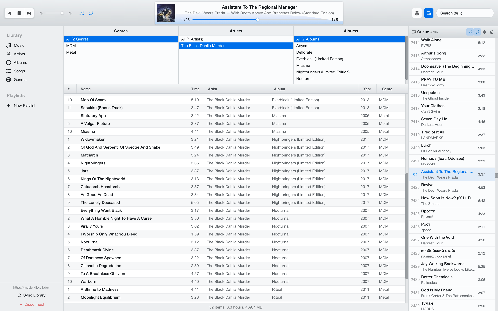

# Stereodrome

Desktop and mobile music player for Subsonic-compatible servers, inspired by classic iTunes-era library browsing.

  

## Features

- Music playback experience inspired by legacy iTunes versions (2010-2012)
- Sync library metadata from your Subsonic server
- Full-text search powered by Tantivy
- System integration: media controls, system tray, keyboard controls
- Local audio cache with configurable size
- Mini player and desktop notifications
- Gapless playback and crossfade
- 12-band equalizer, audio normalization with dynamic compression, binaural audio

## Screenshots

_Coming soon_

## Requirements

### Supported Servers

Stereodrome works with Subsonic API-compatible servers, including:

- [Navidrome](https://www.navidrome.org/) (recommended)
- [Airsonic](https://airsonic.github.io/)
- [Gonic](https://github.com/sentriz/gonic)
- [Subsonic](http://www.subsonic.org/)
- Other compatible servers

### Supported Platforms

- **macOS** 10.15 (Catalina) or later
- **Windows** 10 or later
- **Linux** with GTK 3 and WebKit2GTK
- **iOS** 15 or later
- **Android** 8 or later

## Installation

Download the latest build for your platform from [Releases](https://github.com/xikxp1/Stereodrome/releases).

## Quick Start

1. Launch Stereodrome.
2. Enter your server URL, username, and password.
3. Sync your library.
4. Start playback and adjust settings from the top bar and settings panel.

## Development

`bun install` - Install dependencies (from root directory for desktop or from `mobile` for iOS/Android)
`bun run tauri dev` - Tauri development server
`bun run rust:os` or `bun run rust:android` from `mobile` directory - Cross-compile Rust dependencies for your platform
`bun run ios` or `bun run android` - Build and run the mobile app

## License

MIT

## Contributing

Contributions are welcome! Please open an issue to discuss proposed changes before submitting a pull request.
